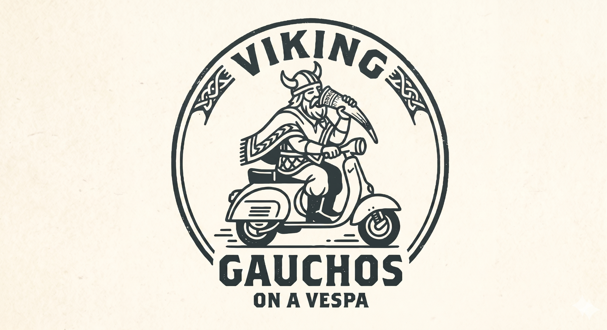

# 🛵 Viking Gauchos on a Vespa

> **Where Northern Might Meets Southern Grit—Cruising at 30 MPH.**

Welcome to the official repository for Team **Viking Gauchos on a Vespa**! We are a crew of nomadic, axe-wielding, caffeinated builders hacking our way through the **Loop Hackathon 2026**. 

Our philosophy is simple: Build with the strength of an empire, the freedom of the pampas, and the fuel efficiency of a 150cc Italian scooter.

---

## 🎨 Our Crest

<p align="center">
  
</p>

*Yes, that is a Viking in a poncho drinking from a horn while operating a motorized vehicle. Do not try this at home.*

---

## 🚀 The Project: [Insert Your App/Project Name]

Give a quick, punchy 2-3 sentence elevator pitch of what you are actually building here. 
* What problem are you solving?
* Why is your solution revolutionary?
* How does it tie into the relentless spirit of a Viking Gaucho?

### 🛠️ The Tech Stack

| Layer | Technology | Why We Chose It |
| :--- | :--- | :--- |
| **Frontend** | React / Next.js / Tailwind | For UI smoother than a Vespa's suspension. |
| **Backend** | Node.js / Python | Robust enough to handle a Viking raid. |
| **Database** | PostgreSQL / MongoDB | Unlimited storage for our data and our *mate* recipes. |
| **Deployment**| Vercel / AWS | Fast deployment before the judges notice we're running on caffeine. |

---

## 👥 The Horde (The Team)

Meet the developers steering this scooter into the future:

* 🛡️ **Patricio Stickar** - *The Chieftain (Lead Dev / Architect)*
  * **Role:** Wields the codebase like a battle-axe.
  * **GitHub:** [@yourusername](https://github.com/yourusername)
* 🧉 **Luca Di Lenola** - *The Asador (Frontend Wizard / UX)*
  * **Role:** Making things look as beautiful as a sunset over the Argentine pampas.
  * **GitHub:** [@teammate1](https://github.com/teammate1)
* 🛵 **Christian Schmidt** - *The Mechanic (DevOps / Backend)*
  * **Role:** Keeping the engine purring and the APIs routing.
  * **GitHub:** [@teammate2](https://github.com/teammate2)

---

## 🛠️ Quick Start

Want to spin up the project locally? Hop on the back of the scooter and follow these steps:

1. **Clone the repository:**
```bash
   git clone [https://github.com/yourusername/viking-gauchos-vespa.git](https://github.com/yourusername/viking-gauchos-vespa.git)

```

2. **Install the dependencies:**

```bash
   cd viking-gauchos-vespa
   npm install

```

3. **Fire up the engine (Development Server):**

```bash
   npm run dev

```

4. Open `http://localhost:3000` and watch the magic happen.

---

## 📜 License

This project is licensed under the **MIT License** — feel free to pillage the code, just give credit to the Gauchos.


